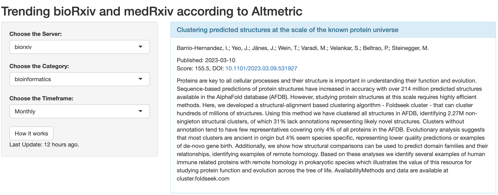

# TRxiv
Tracking popular bioRxiv and medRxiv preprints

## 2023-03-27 更新

北京时间每天 6:00 和 18:00 前后更新数据，更新了一点细节，包括发表时间、Altmetric 分数等信息。

然后因为原本挂在[shinyapps.io](https://yorks0n.shinyapps.io/TRxiv)上，这地方每月免费额度有点少，又整了个 docker 版，目前挂在 [Railway](https://trxiv.up.railway.app/) 上，目前国内网络环境也能直接访问，就是不知道每月免费额度够不够用。

数据处理+整合的代码：https://github.com/Yorks0n/TRxiv

Shiny的代码：https://github.com/Yorks0n/TRxiv_Shiny

欢迎大家提出意见和建议，也欢迎一起来整活。

