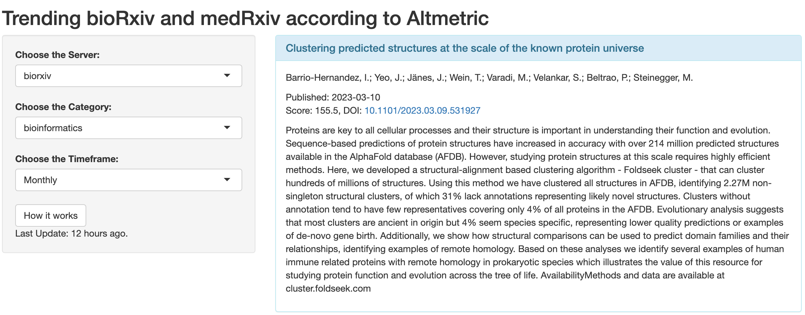

# TRxiv
Tracking popular bioRxiv and medRxiv preprints

## 2023-03-27 更新

更新了一点细节，包括发表时间、Altmetric分数等。

然后因为原本挂在shinyapps.io上（https://yorks0n.shinyapps.io/TRxiv），这地方每月免费额度有点少，又整了个docker版，目前挂在Railway上（https://trxiv.up.railway.app/），目前国内网络环境也能直接访问，就是不知道每月免费额度够不够用。

数据处理+整合的代码：https://github.com/Yorks0n/TRxiv
Shiny的代码：https://github.com/Yorks0n/TRxiv_Shiny

欢迎大家提提意见和建议，也欢迎一起来整活。

